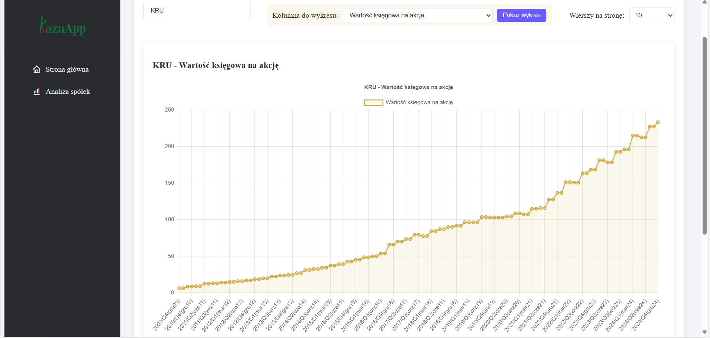
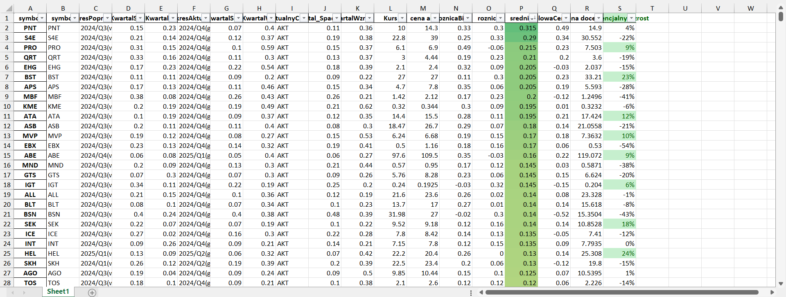
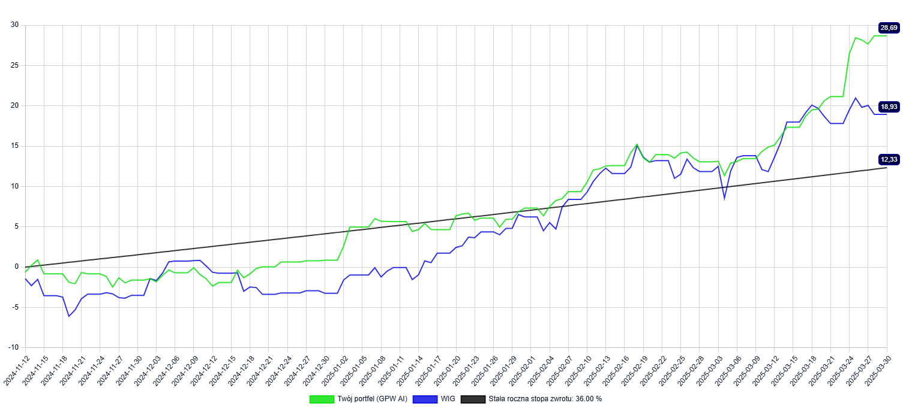

# 📊 Analiza Spółek GPW wspomagana AI | AI-Powered GPW Stock Analysis

**PL:** Narzędzie do analizy fundamentalnej spółek giełdowych z wykorzystaniem sztucznej inteligencji  
**EN:** Fundamental stock analysis tool powered by artificial intelligence

 📧 **Contact:** kazu1916@gmail.com  
💻 **GitHub:** [Kazu1916porfolio](https://github.com/Kazu1916porfolio) | 🔗 **LinkedIn:** [Kamil Wójcik](https://linkedin.com/in/kamil-wójcik-b6b3a6281)


raportSpadekBilans_FINAL.xlsx


## 🌟 Funkcje / Features

| **Polski** | **English** |
|------------|-------------|
| • Automatyczne pobieranie raportów kwartalnych | • Automated quarterly reports scraping |
| • Przetwarzanie i czyszczenie danych finansowych | • Financial data processing and cleaning |
| • Analiza wspomagana modelami uczenia maszynowego | • Analysis supported by machine learning models |
| • Wizualizacja kluczowych wskaźników finansowych | • Visualization of key financial indicators |
| • Prognozy na podstawie danych historycznych | • Forecasts based on historical data |
## 🛠 Technologie / Tech Stack

```python
# Backend
Flask 2.0 | Python 3.10 | REST API

# Data Processing
Pandas | NumPy | BeautifulSoup 4.0

# AI/ML
TensorFlow 2.8 | Prophet | Scikit-learn

# Frontend
HTML5 | CSS3 | Chart.js | JavaScript
```

## 🚀 Uruchomienie lokalne / Local Setup

```bash
# 1. Clone repository
git clone https://github.com/Kazu1916porfolio/GPW_AI.git
cd GPW_AI

# 2. Install dependencies
pip install -r requirements.txt

# 3. Downloading data (reports)
python data_refresh.py

# 4. Adding data files to colab
"Place the files ('maszynowe16.xlsx','maszynoweBilansOnlyV2.xlsx') from the project folder on the disk in colab"

# 4. Model training (optional)
"run the scripts in colab ('training_neural_network_indicators.ipynb','training_neural_network_Balance.ipynb')"

# 5. Prediction and report creation
"run the scripts in colab AI_Indicators.ipynb"
"run the scripts in colab Bilans_raport.ipynb"

# 6. Download the prediction report
"Download file from colab disc 'raportSpadekBilans_FINAL.xlsx'"
# 7. Run application
python app.py
```


## 📊 Aktualny wynik portfela inwestycyjnego od startu (benchmark vs WIG) / Current result of the investment portfolio since the start (benchmark vs WIG)



## 📞 Kontakt / Contact

| **Polski** | **English** |
|------------|-------------|
| ✉️ **Email:** kazu1916@gmail.com | ✉️ **Email:** kazu1916@gmail.com |
| 🐞 **Zgłoszenia błędów:** [GitHub Issues](https://github.com/Kazu1916porfolio/GPW_AI/issues) | 🐞 **Bug Reports:** [GitHub Issues](https://github.com/Kazu1916porfolio/GPW_AI/issues) |
| 💼 **Współpraca:** [LinkedIn](https://linkedin.com/in/kamil-wójcik-b6b3a6281) | 💼 **Collaboration:** [LinkedIn](https://linkedin.com/in/kamil-wójcik-b6b3a6281) |

## 📜 Licencja / License
[MIT License](https://choosealicense.com/licenses/mit/) © 2024 Kamil Wójcik

---

